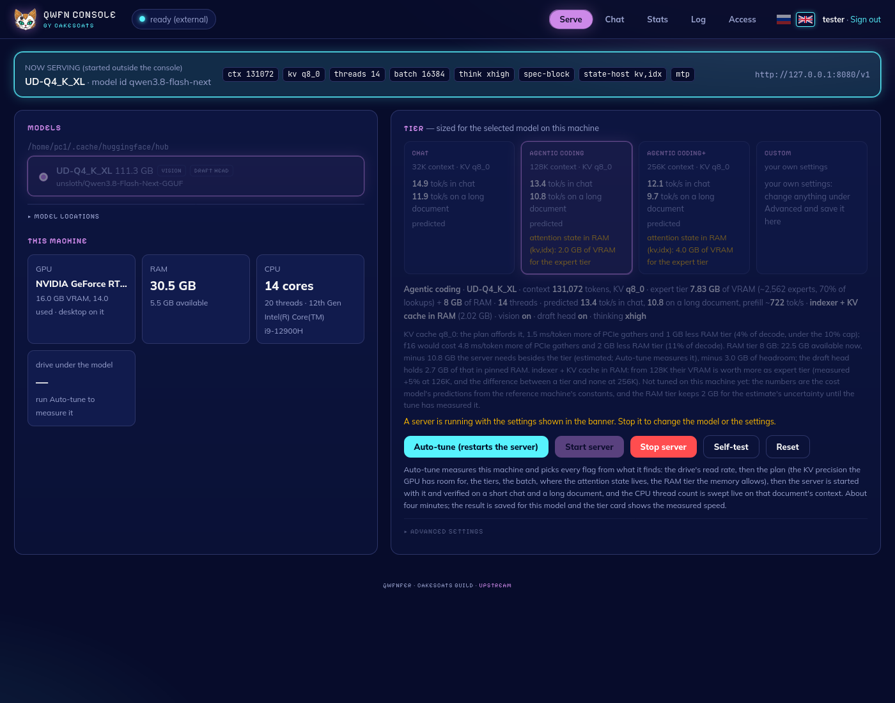
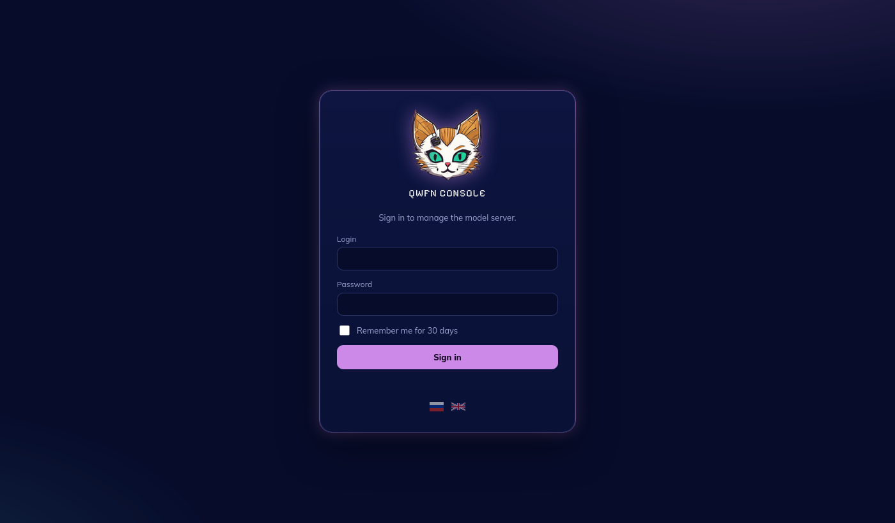
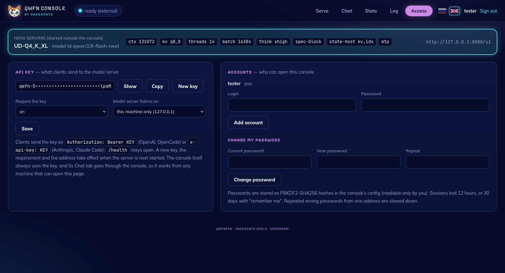

<div align="center">
  
  <h1>qwfnfer · cakescats</h1>
  <p><b>Qwen3.8-Flash-Next (125B MoE, 111 GB) on one 16 GB GPU, 30 GB of RAM and an NVMe.</b><br>
  A fork of <a href="https://github.com/Apolog1ze-Dev/QwFNfer">QwFNfer</a> by cakescats: engine fixes with measurements, and a console with password sign-in, an API key for the model server, HTTPS on the local network and an English / Russian UI.</p>
  <p><b>🇬🇧 English</b> · <a href="README.ru.md">🇷🇺 Русский</a></p>
  <p>
    <a href="#quick-start">Quick start</a> ·
    <a href="#what-this-fork-changes">What changes</a> ·
    <a href="#measurements">Measurements</a> ·
    <a href="#sign-in-access-and-languages">Sign-in &amp; access</a> ·
    <a href="#clients">Clients</a> ·
    <a href="#troubleshooting">Troubleshooting</a> ·
    <a href="CHANGELOG.md">Changelog (RU)</a> ·
    <a href="docs/README.upstream.md">Upstream README</a>
  </p>
</div>

<p align="center"></p>

## What it is

qwfnfer is an inference engine built for one model: **Qwen3.8-Flash-Next** (GGUF architecture `qwen4exp`, 48 layers, 512 experts, top-10). The dense core (~5 GB) lives in VRAM; the experts live in three tiers: hot ones in VRAM, warm ones in pinned RAM, the rest read from the NVMe as 0.6–0.9 MB slices over asynchronous I/O. ggml supplies the quantized CUDA kernels and llama.cpp the tokenizer; the model graph, the memory hierarchy, the expert cache, the prefill, the server and the console are its own.

The server speaks the OpenAI API and the Anthropic Messages API, so OpenCode, Claude Code and any OpenAI client connect to it. The web console sizes the flags for the machine, starts the server and shows live statistics.

This fork is upstream `v0.2.3` (`f955dbf`) plus the changes below. Every performance claim here was measured; the method and the raw numbers are in [docs/TESTING.md](docs/TESTING.md) (in Russian, the tables read on their own).

## What this fork changes

**Engine**
- **io_uring hang** after a short `io_uring_submit()`: the ring is flushed before waiting, and a ring that does not drain returns a short read instead of blocking.
- **Completion count** broken by a rejected request (it left `fetch_end()` waiting, or made the caller resubmit it for ever): such requests now complete as errors.
- **`abort()` on HTTP request paths** → the failure is recorded and unwound, the engine marks itself `needs_reset()` and the server resets the session. *See the limits below: running out of VRAM still ends the process inside ggml-cuda.*
- **Prefill ring depth** under `--io-uring` is sized from the read window; the sweep used to run at half its concurrency.
- **Platform layer** (`qwfn_plat.h`, POSIX + Win32, an IOCP backend) as groundwork for Windows; the Win32 half has not been built yet.
- **`qwfn-iobench`** measures both read engines.

**Console**
- **Password sign-in** (PBKDF2-SHA256, sessions, per-address backoff), several accounts, password change.
- **API key for the model server**: the console generates it and hands it to the server; the console's Chat tab goes through the console, so the key never reaches the browser.
- **Local network and HTTPS**: `--host 0.0.0.0`, `--tls-cert/--tls-key`, a self-signed certificate in one command.
- **Languages**: English and Russian, switched with flags; translations are JSON catalogs, a new language is a new file.
- **cakescats theme**: night navy, orchid, neon cyan, pixel headings, the brand logo.

**Model server**: `--api-key` / `--api-key-file` / `QWFN_API_KEY`; the key is checked on every endpoint but `/health` (`Authorization: Bearer …` or `x-api-key: …`).

**Docs and tests**: a working llama.cpp revision instead of the moved upstream tag, `docs/TESTING.md`, `scripts/ab_decode.sh` and `scripts/oom_survival.sh`.

**Proposed upstream:** [#13](https://github.com/Apolog1ze-Dev/QwFNfer/pull/13) pins llama.cpp by commit, [#14](https://github.com/Apolog1ze-Dev/QwFNfer/pull/14) carries the I/O fixes.

## Measurements

i9-12900H · RTX 3080 Ti Laptop 16 GB · 30.5 GB RAM · NVMe at 6.2 GB/s · UD-Q4_K_XL. Upstream against this fork, 128 greedy tokens, 3 interleaved runs each:

| `qwfn-gen` mode | Upstream | This fork | Output |
|---|---|---|---|
| threads (default) | 7.92 tok/s | **7.95** tok/s | bit-identical |
| `--io-uring` | 8.47 | **8.50** | bit-identical |
| `--vram 9` | 10.04 | **10.00** | as upstream |

Server, Agentic coding tier (128K, KV q8_0, MTP draft head): **12.0–12.6 tok/s** with 93–95% of drafts accepted; 10.9 tok/s on the same tier without MTP.

To be plain about it: the engine changes are about reliability, not speed, and speed is at parity with upstream. One "optimization" from the first round of changes slowed decode by 2%; these measurements caught it and it was reverted.

## Requirements

- **Linux**, Ubuntu 22.04 or newer (the release bundle needs glibc ≥ 2.34).
- **NVIDIA** with driver ≥ 580 and **at least 8 GB of VRAM**; AMD and Intel are not supported (ggml's CUDA backend).
- **NVMe** with 112+ GB free on ext4 / xfs / btrfs (`O_DIRECT` is required). A spinning disk will not work.
- **RAM**: 16 GB minimum, 32 GB is comfortable.

Check in one command:

```bash
lsb_release -ds && nvidia-smi --query-gpu=name,driver_version,memory.total --format=csv,noheader && lsblk -d -o NAME,ROTA,MODEL && df -hT ~ | tail -1
```

## Quick start

### 1. Dependencies

```bash
sudo apt install -y git build-essential g++-13 cmake ninja-build liburing-dev nvidia-cuda-toolkit python3-pip
```

### 2. llama.cpp with `qwen4exp`

> **Do not use the `b10798-mix-659e406` tag from the upstream README.** It has been moved to a commit without `qwen4exp`: the engine builds, but the tokenizer refuses the model (`unknown model architecture: 'qwen4exp'`). The working revision is commit `ca14269` (branch `mtp/qwen4exp-nextn`, 2026-09-18), pinned by SHA so it cannot move again.

Ubuntu's `nvcc` 12.4 does not accept gcc newer than 13, so the CUDA half is built with g++-13:

```bash
git init ~/.unsloth/llama.cpp && git -C ~/.unsloth/llama.cpp fetch --depth 1 https://github.com/unslothai/llama.cpp ca1426903fabe9af26cd10c42034cb4bbd2e0e11 && git -C ~/.unsloth/llama.cpp checkout FETCH_HEAD && cmake -S ~/.unsloth/llama.cpp -B ~/.unsloth/llama.cpp/build -G Ninja -DCMAKE_BUILD_TYPE=Release -DGGML_CUDA=ON -DCMAKE_CUDA_ARCHITECTURES=native -DCMAKE_CUDA_HOST_COMPILER=/usr/bin/g++-13 -DLLAMA_CURL=OFF && cmake --build ~/.unsloth/llama.cpp/build -j
```

### 3. The engine

```bash
cmake -B build -G Ninja -DCMAKE_BUILD_TYPE=Release && cmake --build build -j
```

### 4. The model

```bash
pip install -U huggingface_hub
```

Q4, for quality, 111.3 GB:

```bash
hf download unsloth/Qwen3.8-Flash-Next-GGUF --include "UD-Q4_K_XL/*" "mmproj-F16.gguf"
```

Q3, for speed, 90.0 GB (take this one with 12 GB of VRAM or less):

```bash
hf download unsloth/Qwen3.8-Flash-Next-GGUF --include "UD-Q3_K_XL/*" "mmproj-F16.gguf"
```

The draft head, +12–13% for agentic work, exactly one 2.79 GB file (do not use `MTP/*`, that is 24.6 GB of every variant):

```bash
hf download unsloth/Qwen3.8-Flash-Next-GGUF --include "MTP/mtp-Qwen3.8-Flash-Next-Q4_K_M.gguf"
```

### 5. Run

```bash
scripts/console.sh
```

Open http://127.0.0.1:8090, pick the model and a tier (**Chat** 32K, **Agentic coding** 128K or **Agentic coding+** 256K) and press **Auto-tune & start**. For about four minutes the console measures the drive, plans for your VRAM and RAM, starts the server, checks it on a short chat and on a document with a planted passphrase, and sweeps the CPU thread count. The result is saved; after that **Start server** is enough.

The server listens on `http://127.0.0.1:8080`; the API key for clients is on the Access tab (the first visit asks you to create an account, see below).

## Sign-in, access and languages

<p align="center"> </p>

**First run.** Open the console from the same machine and it offers to create an account (a login and a password of 8 characters or more). From another machine the first account can only be created with the setup code the console prints in its terminal at start. The browser can remember the login and password; "Remember me" keeps the session for 30 days instead of 12 hours.

**The Access tab.** The model server's API key (show, copy, issue a new one), whether it is required, and which address the server listens on (this machine only, or the local network); accounts and password change. A new key and a new address take effect when the server is next started.

**The console on the local network, over HTTPS:**

```bash
scripts/gen-cert.sh
```

```bash
scripts/console.sh --host 0.0.0.0 --tls-cert ~/.cache/qwfn-console/tls/cert.pem --tls-key ~/.cache/qwfn-console/tls/key.pem
```

The certificate is self-signed: on the first visit the browser warns; compare the SHA-256 fingerprint `gen-cert.sh` printed. Without `--tls-cert` the console works on the network too, but the password then crosses it in clear text (the console warns about it).

**Languages.** Flags in the header and on the sign-in page; the choice is remembered by the browser. Catalogs live in `tools/console/i18n/*.json`: `html` holds page fragments, `messages` printf-style message patterns (`%d GB …`) that are translated after formatting. Check a catalog:

```bash
python3 -c "import sys; sys.path.insert(0,'tools'); import qwfn_i18n; print(qwfn_i18n.Catalogs('tools/console/i18n').check('ru') or 'ok')"
```

**Scripts** (`scripts/claude-desktop.sh`) get in without a browser: on every start the console writes a token to `~/.cache/qwfn-console/console_token` (mode 0600) and accepts it from this machine only.

## Clients

The key is on the Access tab (the Copy button); `KEY` below stands for it.

**OpenCode**, `~/.config/opencode/opencode.jsonc`. Set the context limit to the tier you run, so OpenCode compacts the history in time:

```json
{
  "$schema": "https://opencode.ai/config.json",
  "provider": {
    "qwfn": {
      "name": "qwfn",
      "npm": "@ai-sdk/openai-compatible",
      "options": { "baseURL": "http://127.0.0.1:8080/v1", "apiKey": "KEY" },
      "models": {
        "qwen3.8-flash-next": { "name": "qwen3.8-flash-next", "limit": { "context": 131072, "output": 32768 } }
      }
    }
  }
}
```

**Claude Code**: the server speaks the Anthropic Messages API; point it at the root, not at `/v1`. Match the context limit to the tier too:

```bash
ANTHROPIC_BASE_URL=http://127.0.0.1:8080 ANTHROPIC_API_KEY=KEY ANTHROPIC_MODEL=qwen3.8-flash-next CLAUDE_CODE_MAX_CONTEXT_TOKENS=131072 claude
```

**Any OpenAI client**: base URL `http://127.0.0.1:8080/v1`, model `qwen3.8-flash-next`, key in `Authorization: Bearer KEY`. Thinking is set per request with `reasoning_effort` (`xhigh` · `medium` · `low` · `off`) or by ending a message with `/think` / `/no_think`.

**Service endpoints** (key required except `/health`): `/stats` (speed, context, expert cache, drafts), `/metrics` (Prometheus), `/slots`, `/props`, `/health`.

## Troubleshooting

**The server exited with code 134 and `CUDA error: out of memory` in the log.** VRAM ran out during decode: ggml-cuda ends the process, and the engine cannot catch it (neither here nor upstream). Free the GPU of other processes, do not start a second server, raise "VRAM reserve" under Advanced settings. As a last resort, `GGML_CUDA_DISABLE_GRAPHS=1` lets the server survive the shortage at about 15% of its speed.

**A client gets `401 invalid or missing API key`.** The client has no key or an old one: copy it from the Access tab. After "New key" the old one stops working at the next server start. The requirement can be switched off there too ("Require the key: off").

**Forgotten password.** Stop the console and delete the `"users"` block from `~/.cache/qwfn-console/config.json` (or all of `"auth"`, which also replaces the API key); on its next start the console offers to create an account again.

**A second server does not start: `engine init: failed to allocate … on CUDA0`.** The first one holds the VRAM. Only one runs at a time.

**The console does not see the model.** Serve tab → Model locations lists the folders scanned and the reason each GGUF it found was rejected. A download made with `--local-dir` sits outside the cache: add its folder. An interrupted download looks the same: run the same `hf download` again.

**Decode is slower than expected.** The Log tab shows what the engine really built: the VRAM and RAM tiers. The usual causes are little free RAM, another process on the GPU, or a cold cache (the first request is always slower).

## Tests

```bash
MODEL=/path/to/Qwen3.8-Flash-Next-UD-Q4_K_XL-00001-of-00004.gguf scripts/ab_decode.sh /path/to/other/build/qwfn-gen build/qwfn-gen --io-uring
```

```bash
nvcc -ccbin g++-13 -O2 -o build/qwfn-vram-hog tools/qwfn_vram_hog.cu && MODEL=/path/to/...-00001-of-00004.gguf scripts/oom_survival.sh build/qwfn-server
```

Both take the whole GPU: stop the server first.

## Credits and license

The engine, the console and the original documentation: [Apolog1ze-Dev/QwFNfer](https://github.com/Apolog1ze-Dev/QwFNfer) (Karim Dagher), Apache 2.0. This fork's changes are under the same terms, see [LICENSE](LICENSE). The model: [unsloth/Qwen3.8-Flash-Next-GGUF](https://huggingface.co/unsloth/Qwen3.8-Flash-Next-GGUF); ggml and the tokenizer: [llama.cpp](https://github.com/ggml-org/llama.cpp).
