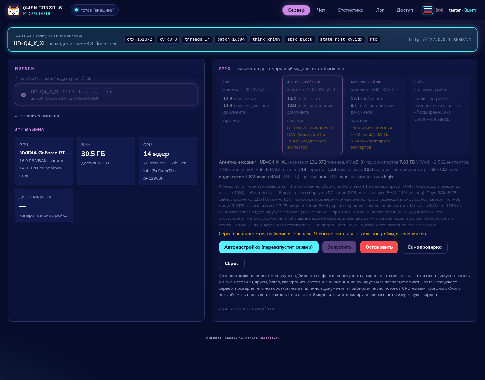
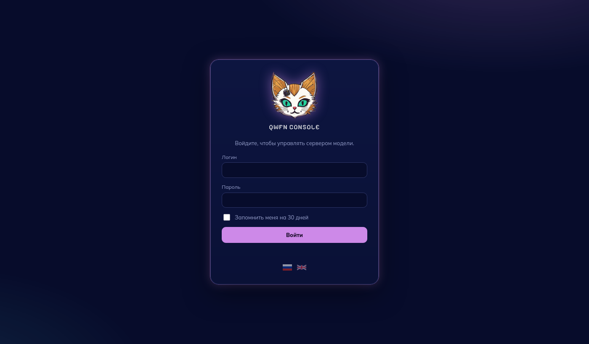
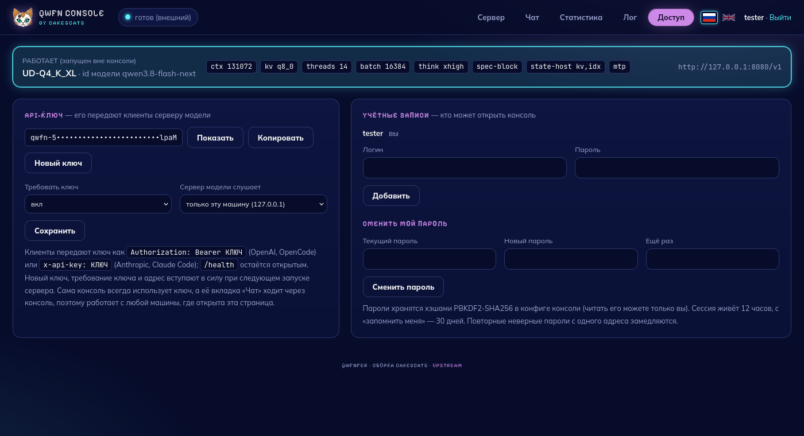

<div align="center">
  
  <h1>qwfnfer · cakescats</h1>
  <p><b>Qwen3.8-Flash-Next (MoE 125B, 111 ГБ) на одной видеокарте 16 ГБ, 30 ГБ RAM и NVMe.</b><br>
  Сборка движка <a href="https://github.com/Apolog1ze-Dev/QwFNfer">QwFNfer</a> от cakescats: исправления движка, замеры, консоль с входом по паролю, API-ключом и переключением языков (RU / EN).</p>
  <p><a href="README.md">🇬🇧 English</a> · <b>🇷🇺 Русский</b></p>
  <p>
    <a href="#быстрый-старт">Быстрый старт</a> ·
    <a href="#что-изменено">Что изменено</a> ·
    <a href="#замеры">Замеры</a> ·
    <a href="#вход-доступ-и-языки">Вход и доступ</a> ·
    <a href="#подключение-клиентов">Клиенты</a> ·
    <a href="#если-что-то-не-так">Проблемы</a> ·
    <a href="CHANGELOG.md">История изменений</a> ·
    <a href="docs/README.upstream.md">Оригинальный README</a>
  </p>
</div>

<p align="center"></p>

## Что это

qwfnfer — движок инференса, написанный под одну модель: **Qwen3.8-Flash-Next** (GGUF-архитектура `qwen4exp`, 48 слоёв, 512 экспертов, top-10). Плотное ядро модели (~5 ГБ) живёт в VRAM, а эксперты — в трёх ярусах: горячие в VRAM, тёплые в закреплённой RAM, остальные читаются с NVMe срезами по 0.6–0.9 МБ через асинхронный ввод-вывод. Кванты берутся из ggml (CUDA), токенизатор — из llama.cpp; граф модели, иерархия памяти, кэш экспертов, prefill, сервер и консоль — свои.

Сервер отдаёт OpenAI-совместимый API и Anthropic Messages API, так что к нему подключаются OpenCode, Claude Code и любой OpenAI-клиент. Веб-консоль подбирает флаги под машину, запускает сервер и показывает живую статистику.

Эта ветка — upstream `v0.2.3` (`f955dbf`) плюс изменения ниже. Всё, что сказано о производительности, измерено; методика и сырые цифры — в [docs/TESTING.md](docs/TESTING.md).

## Что изменено

**Движок**
- **Зависание в io_uring** при коротком `io_uring_submit()` — исправлено: кольцо дочищается перед ожиданием, при отказе возвращается короткое чтение.
- **Рассинхрон счёта заявок** (пропущенная «плохая» заявка вешала `fetch_end()` или зацикливала повторы) — такие заявки теперь завершаются ошибкой.
- **`abort()` на путях HTTP-запроса** → запись ошибки, раскрутка, `needs_reset()` и сброс сессии сервером. *Но см. ограничения: реальная нехватка VRAM убивает процесс внутри ggml-cuda.*
- **Глубина кольца prefill** под `--io-uring` считается от окна чтения — раньше развёртка шла на половине конкурентности.
- **Платформенный слой** (`qwfn_plat.h`, POSIX + Win32, IOCP-бэкенд) — задел под Windows-порт; Win32 пока не собирался.
- **`qwfn-iobench`** меряет оба движка чтения.

**Консоль**
- **Вход по логину и паролю** (PBKDF2-SHA256, сессии, замедление перебора), несколько учётных записей, смена пароля.
- **API-ключ сервера модели**: консоль генерирует его и передаёт серверу; чат консоли ходит через неё, ключ в браузер не попадает.
- **Локальная сеть и HTTPS**: `--host 0.0.0.0`, `--tls-cert/--tls-key`, самоподписанный сертификат одной командой.
- **Языки**: русский и английский с переключением флажками; перевод — каталоги JSON, новый язык = новый файл.
- **Тема cakescats**: ночной синий, орхидея, неоновый циан, пиксельные заголовки, фирменный логотип.

**Сервер модели** — `--api-key` / `--api-key-file` / `QWFN_API_KEY`: ключ проверяется на всех эндпоинтах, кроме `/health` (`Authorization: Bearer …` или `x-api-key: …`).

**Документация и тесты** — рабочая ревизия llama.cpp вместо переписанного upstream-тега, `docs/TESTING.md`, скрипты `scripts/ab_decode.sh` и `scripts/oom_survival.sh`.

**Предложено в оригинал:** [#13](https://github.com/Apolog1ze-Dev/QwFNfer/pull/13) — закрепить llama.cpp по коммиту, [#14](https://github.com/Apolog1ze-Dev/QwFNfer/pull/14) — исправления ввода-вывода.

Подробно — в [CHANGELOG.md](CHANGELOG.md).

## Замеры

i9-12900H · RTX 3080 Ti Laptop 16 ГБ · 30.5 ГБ RAM · NVMe 6.2 ГБ/с · UD-Q4_K_XL. Оригинал против этой ветки, 128 токенов жадного декода, по 3 чередующихся прогона:

| Режим `qwfn-gen` | Оригинал | Эта ветка | Вывод |
|---|---|---|---|
| потоки (по умолчанию) | 7.92 ток/с | **7.95** ток/с | побитово одинаковый |
| `--io-uring` | 8.47 | **8.50** | побитово одинаковый |
| `--vram 9` | 10.04 | **10.00** | как в оригинале |

Сервер, ярус «Агентный кодинг» (128K, KV q8_0, черновая голова MTP): **12.0–12.6 ток/с**, принято 93–95% черновиков; без MTP на том же ярусе — 10.9 ток/с.

Итог честный: правки движка — про надёжность, а не про скорость; скорость на уровне оригинала. Одна «оптимизация» из первоначального набора замедляла декод на 2% — найдена этими же замерами и откачена.

## Требования

- **Linux**, Ubuntu 22.04+ (для готового бандла нужен glibc ≥ 2.34).
- **NVIDIA** с драйвером ≥ 580 и **от 8 ГБ VRAM**; AMD и Intel не поддерживаются (CUDA-бэкенд ggml).
- **NVMe** с 112+ ГБ свободного места на ext4 / xfs / btrfs (нужен `O_DIRECT`). На HDD не работает.
- **RAM** от 16 ГБ, комфортно — 32 ГБ.

Проверка одной командой:

```bash
lsb_release -ds && nvidia-smi --query-gpu=name,driver_version,memory.total --format=csv,noheader && lsblk -d -o NAME,ROTA,MODEL && df -hT ~ | tail -1
```

## Быстрый старт

### 1. Зависимости

```bash
sudo apt install -y git build-essential g++-13 cmake ninja-build liburing-dev nvidia-cuda-toolkit python3-pip
```

### 2. llama.cpp с `qwen4exp`

> **Не используйте тег `b10798-mix-659e406` из upstream README** — его переписали, под ним теперь коммит без `qwen4exp`: движок соберётся, но токенизатор откажется грузить модель (`unknown model architecture: 'qwen4exp'`). Рабочая ревизия — коммит `ca14269` (ветка `mtp/qwen4exp-nextn`, 2026-09-18), закрепляем по хэшу, чтобы он больше не уехал.

`nvcc` 12.4 из Ubuntu не поддерживает gcc новее 13, поэтому CUDA-часть собирается с g++-13:

```bash
git init ~/.unsloth/llama.cpp && git -C ~/.unsloth/llama.cpp fetch --depth 1 https://github.com/unslothai/llama.cpp ca1426903fabe9af26cd10c42034cb4bbd2e0e11 && git -C ~/.unsloth/llama.cpp checkout FETCH_HEAD && cmake -S ~/.unsloth/llama.cpp -B ~/.unsloth/llama.cpp/build -G Ninja -DCMAKE_BUILD_TYPE=Release -DGGML_CUDA=ON -DCMAKE_CUDA_ARCHITECTURES=native -DCMAKE_CUDA_HOST_COMPILER=/usr/bin/g++-13 -DLLAMA_CURL=OFF && cmake --build ~/.unsloth/llama.cpp/build -j
```

### 3. Движок

```bash
cmake -B build -G Ninja -DCMAKE_BUILD_TYPE=Release && cmake --build build -j
```

### 4. Модель

```bash
pip install -U huggingface_hub
```

Q4 — по качеству, 111.3 ГБ:

```bash
hf download unsloth/Qwen3.8-Flash-Next-GGUF --include "UD-Q4_K_XL/*" "mmproj-F16.gguf"
```

Q3 — по скорости, 90.0 ГБ (при VRAM ≤ 12 ГБ берите его):

```bash
hf download unsloth/Qwen3.8-Flash-Next-GGUF --include "UD-Q3_K_XL/*" "mmproj-F16.gguf"
```

Черновая голова — +12–13% в агентной работе, ровно один файл на 2.79 ГБ (не пишите `MTP/*`, это 24.6 ГБ всех вариантов):

```bash
hf download unsloth/Qwen3.8-Flash-Next-GGUF --include "MTP/mtp-Qwen3.8-Flash-Next-Q4_K_M.gguf"
```

### 5. Запуск

```bash
scripts/console.sh
```

Откройте http://127.0.0.1:8090, выберите модель и ярус — **Чат** (32K), **Агентный кодинг** (128K) или **Агентный кодинг+** (256K) — и нажмите **«Автонастройка и запуск»**. Около четырёх минут консоль меряет диск, рассчитывает план под вашу VRAM и RAM, поднимает сервер, проверяет его на коротком чате и на документе с подсаженной фразой и подбирает число потоков. Результат сохраняется; дальше хватает кнопки **«Запустить»**.

Сервер слушает `http://127.0.0.1:8080`; API-ключ для клиентов — на вкладке «Доступ» (при первом открытии консоль попросит создать учётную запись, см. ниже).

## Вход, доступ и языки

<p align="center"> </p>

**Первый запуск.** Откройте консоль с этой же машины — она предложит создать учётную запись (логин и пароль от 8 символов). С другой машины первую запись можно создать только с кодом настройки, который консоль печатает в терминале при старте. Браузер предложит запомнить логин и пароль; галочка «Запомнить меня» держит сессию 30 дней вместо 12 часов.

**Вкладка «Доступ».** API-ключ сервера модели (показать, скопировать, выпустить новый), требовать ли его и на каком адресе слушать сервер (только эта машина или локальная сеть); учётные записи и смена пароля. Изменения ключа и адреса вступают в силу при следующем запуске сервера.

**Консоль в локальной сети, по HTTPS:**

```bash
scripts/gen-cert.sh
```

```bash
scripts/console.sh --host 0.0.0.0 --tls-cert ~/.cache/qwfn-console/tls/cert.pem --tls-key ~/.cache/qwfn-console/tls/key.pem
```

Сертификат самоподписанный: при первом заходе браузер предупредит — сверьте отпечаток SHA-256, который напечатал `gen-cert.sh`. Без `--tls-cert` консоль в сети тоже работает, но пароль тогда идёт открытым текстом (консоль об этом предупреждает).

**Языки.** Флажки в шапке и на странице входа; выбор запоминается в браузере. Каталоги — `tools/console/i18n/*.json`: `html` — фрагменты страницы, `messages` — шаблоны сообщений в стиле printf (`%d ГБ …`), которые переводятся уже после форматирования. Проверка каталога:

```bash
python3 -c "import sys; sys.path.insert(0,'tools'); import qwfn_i18n; print(qwfn_i18n.Catalogs('tools/console/i18n').check('ru') or 'ok')"
```

**Скрипты** (`scripts/claude-desktop.sh`) входят без браузера: консоль при каждом старте пишет токен в `~/.cache/qwfn-console/console_token` (0600) и принимает его только с этой машины.

## Подключение клиентов

Ключ — на вкладке «Доступ» (кнопка «Копировать»). Ниже `КЛЮЧ` — это он.

**OpenCode** — `~/.config/opencode/opencode.jsonc`. Лимит контекста стоит указать под выбранный ярус, чтобы OpenCode сжимал историю вовремя:

```json
{
  "$schema": "https://opencode.ai/config.json",
  "provider": {
    "qwfn": {
      "name": "qwfn",
      "npm": "@ai-sdk/openai-compatible",
      "options": { "baseURL": "http://127.0.0.1:8080/v1", "apiKey": "КЛЮЧ" },
      "models": {
        "qwen3.8-flash-next": { "name": "qwen3.8-flash-next", "limit": { "context": 131072, "output": 32768 } }
      }
    }
  }
}
```

**Claude Code** — сервер отдаёт Anthropic Messages API, подключение к корню, не к `/v1`. Лимит контекста — тоже под ярус:

```bash
ANTHROPIC_BASE_URL=http://127.0.0.1:8080 ANTHROPIC_API_KEY=КЛЮЧ ANTHROPIC_MODEL=qwen3.8-flash-next CLAUDE_CODE_MAX_CONTEXT_TOKENS=131072 claude
```

**Любой OpenAI-клиент** — базовый URL `http://127.0.0.1:8080/v1`, модель `qwen3.8-flash-next`, ключ в `Authorization: Bearer КЛЮЧ`. Размышления — через `reasoning_effort` (`xhigh` · `medium` · `low` · `off`) или `/think` / `/no_think` в конце сообщения.

**Служебные эндпоинты** (с ключом, кроме `/health`): `/stats` (скорость, контекст, кэш экспертов, черновики), `/metrics` (Prometheus), `/slots`, `/props`, `/health`.

## Если что-то не так

**Сервер упал с кодом 134 и `CUDA error: out of memory` в логе.** Во время декода кончилась VRAM: ggml-cuda завершает процесс, и перехватить это из движка нельзя (ни здесь, ни в оригинале). Уберите с GPU другие процессы, не запускайте второй сервер, увеличьте «Резерв VRAM» в расширенных настройках. Крайняя мера — `GGML_CUDA_DISABLE_GRAPHS=1`: сервер переживает нехватку, но теряет около 15% скорости.

**Клиент получает `401 invalid or missing API key`.** В клиенте нет ключа или он старый: скопируйте ключ на вкладке «Доступ». После «Нового ключа» старый перестаёт работать при следующем запуске сервера. Отключить требование — там же, «Требовать ключ: выкл».

**Забыли пароль.** Остановите консоль и удалите блок `"users"` из `~/.cache/qwfn-console/config.json` (или весь `"auth"`, тогда сменится и API-ключ) — при следующем запуске консоль снова предложит создать учётную запись.

**Второй сервер не стартует: `engine init: failed to allocate … on CUDA0`.** Первый уже держит VRAM. Одновременно работает только один.

**Консоль не видит модель.** Вкладка «Сервер» → «Где искать модели»: там список папок и причина отказа по каждому найденному GGUF. Загрузка с `--local-dir` лежит вне кэша — добавьте папку. Оборванная загрузка выглядит так же: повторите ту же команду `hf download`.

**Декод медленнее ожидаемого.** Вкладка «Лог» показывает, что движок реально построил: ярусы в VRAM и RAM. Частые причины — мало свободной RAM, другой процесс на GPU, холодный кэш (первый запрос всегда медленнее).

**`claude: команда не найдена`.** Claude Code CLI не установлен отдельно (у Claude Desktop он свой, внутри приложения). Установите CLI или запустите бинарник из `~/.config/Claude/claude-code/<версия>/claude`.

## Тесты

```bash
MODEL=/путь/к/Qwen3.8-Flash-Next-UD-Q4_K_XL-00001-of-00004.gguf scripts/ab_decode.sh /путь/к/другой/build/qwfn-gen build/qwfn-gen --io-uring
```

```bash
nvcc -ccbin g++-13 -O2 -o build/qwfn-vram-hog tools/qwfn_vram_hog.cu && MODEL=/путь/к/...-00001-of-00004.gguf scripts/oom_survival.sh build/qwfn-server
```

Оба теста занимают GPU целиком — остановите сервер перед запуском.

## Благодарности и лицензия

Движок, консоль и исходная документация — [Apolog1ze-Dev/QwFNfer](https://github.com/Apolog1ze-Dev/QwFNfer) (Karim Dagher), Apache 2.0. Изменения этой ветки распространяются на тех же условиях, см. [LICENSE](LICENSE). Модель — [unsloth/Qwen3.8-Flash-Next-GGUF](https://huggingface.co/unsloth/Qwen3.8-Flash-Next-GGUF); ggml и токенизатор — [llama.cpp](https://github.com/ggml-org/llama.cpp).
